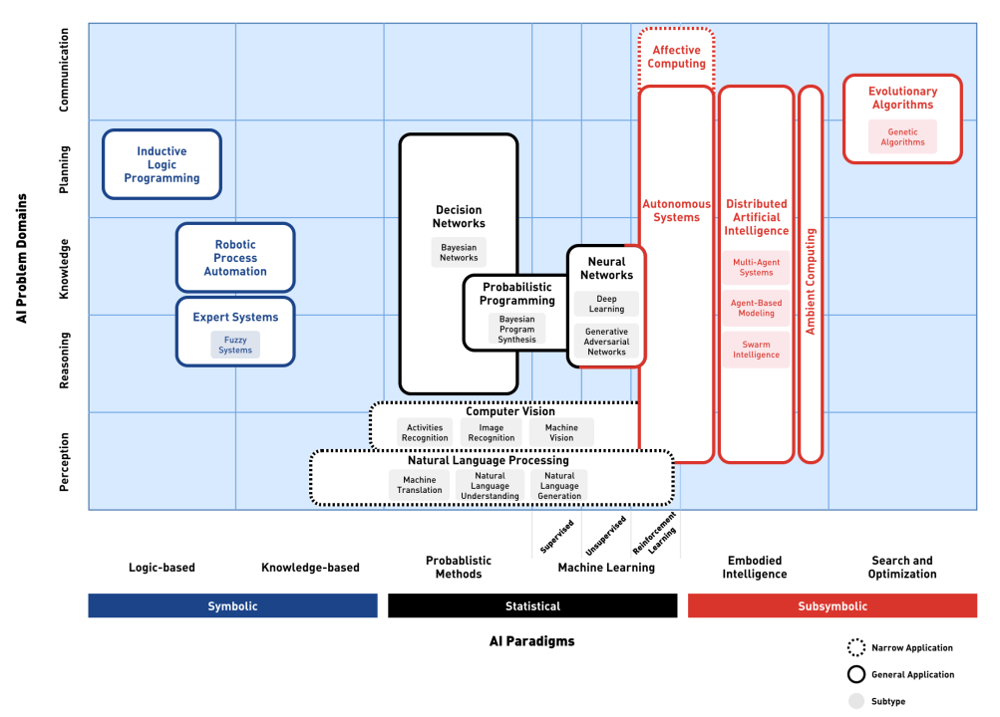

# 🔮 Artificial Intelligence

Notes and resources on Artificial Intelligence and Machine Learning.

    
Domains of AI

    

## Tools

### [LlamaIndex](https://github.com/run-llama/llama_index)

LlamaIndex (GPT Index) is a project that provides a central interface to connect your LLM's with external data.

## Resources

### [LLM Extractum](https://llm.extractum.io/)

A curated list of open-source LLMs.

### [LLM Visualization](https://bbycroft.net/llm)

3D animated visualisation of an GPT-style LLM with a walkthrough.

### 📊 [Directory of Generative AI](https://docs.google.com/spreadsheets/d/1gc6yse74XCwBx028HV_cvdxwXkmXejVjkO-Mz2uwE0k/)

A comprehensive Excel sheet with a list of models and their metadata (parameters, release date, etc).

### [Dive into Deep Learning](https://d2l.ai/)

Interactive deep learning book with multi-framework code, math, and discussions (adopted at Stanford, MIT, Harvard, and Cambridge, and so on).

#### [d2l-ai/d2l-en](https://github.com/d2l-ai/d2l-en) ⭐ 24k

The book's repository with notes in `.md` format.

### [Deep Learning with Python Notebooks](https://github.com/fchollet/deep-learning-with-python-notebooks)

Jupyter notebooks for the code samples of the book "Deep Learning with Python"

### [mlcourse.ai](https://mlcourse.ai/book/index.html)

An open Machine Learning course that aims for a perfect balance between theory and practice.

### [ageron/handson-ml3](https://github.com/ageron/handson-ml3) ⭐ 8k

A series of Jupyter notebooks that walk you through the fundamentals of "Machine Learning and Deep Learning in Python using Scikit-Learn, Keras and TensorFlow 3".

#### [ageron/handson-ml2](https://github.com/ageron/handson-ml2) ⭐ 30k

### [nyandwi/machine_learning_complete](https://github.com/Nyandwi/machine_learning_complete)

A comprehensive machine learning repository containing 30+ notebooks on different concepts, algorithms and techniques.

### 📏 [hrnbot/basic-mathematics-for-ml](https://github.com/hrnbot/Basic-Mathematics-for-Machine-Learning)

A collection of jupyter notebooks that cover algebra, calculus, linear algebra, probability and statistics.

### [maxim5/cs229-2018-autumn](https://github.com/maxim5/cs229-2018-autumn)

All notes and materials for Stanford CS229: Machine Learning taught by Andrew Ng.

## Awesome Lists

- [Awesome AI for LAM](https://ai4lam.github.io/awesome-ai4lam)
- [Awesome Computer Vision](https://github.com/jbhuang0604/awesome-computer-vision#readme)
- [Awesome Deep Learning for NLP](https://github.com/brianspiering/awesome-dl4nlp#readme)
- [Awesome Deep Learning](https://github.com/ChristosChristofidis/awesome-deep-learning#readme)
- [Awesome Deep Learning Resources](https://github.com/guillaume-chevalier/awesome-deep-learning-resources#readme)
- [Awesome Deep Vision](https://github.com/kjw0612/awesome-deep-vision#readme)
- [Awesome Document Understanding](https://github.com/tstanislawek/awesome-document-understanding#readme)
- [Awesome Generative AI](https://github.com/steven2358/awesome-generative-ai#readme)
- [Awesome Image Classification](https://github.com/weiaicunzai/awesome-image-classification#readme)
- [Awesome Jupyter GLAM](https://github.com/LibraryCarpentry/awesome-jupyter-glam#readme)
- [Awesome LLM](https://github.com/Hannibal046/Awesome-LLM#readme)
- [Awesome LLMOps](https://github.com/tensorchord/Awesome-LLMOps) — [related awesome lists](https://github.com/tensorchord/Awesome-LLMOps?tab=readme-ov-file#awesome-lists)
- [Awesome Machine Learning](https://github.com/josephmisiti/awesome-machine-learning#readme)
- [Awesome ML](https://github.com/underlines/awesome-ml) — [awesome-ml/llm-tools](https://github.com/underlines/awesome-ml/blob/master/llm-tools.md)
- [Awesome Machine Learning & Deep Learning Tutorials](https://github.com/ujjwalkarn/Machine-Learning-Tutorials#readme)
- [Awesome Natural Language Generation](https://github.com/accelerated-text/awesome-nlg#readme)
- [Awesome NLP](https://github.com/keon/awesome-nlp#readme)
- [Awesome Production Machine Learning](https://github.com/EthicalML/awesome-production-machine-learning#readme)
- [Awesome Software Engineering for Machine Learning](https://github.com/SE-ML/awesome-seml#readme)
- [Awesome Visual Transformer](https://github.com/dk-liang/Awesome-Visual-Transformer#readme)
- [Awesome XAI](https://github.com/altamiracorp/awesome-xai#readme)
- [The NLP Index](https://index.quantumstat.com)

## Articles

- [The Transformer Family Version 2.0](https://lilianweng.github.io/posts/2023-01-27-the-transformer-family-v2/) ⭐

- [The 6 Best LLM Tools To Run Models Locally](https://getstream.io/blog/best-local-llm-tools/)

- [12 LLM Projects For All Levels](https://www.datacamp.com/blog/llm-projects)

- [Top 15 LLMOps Tools for Building AI Applications in 2024](https://www.datacamp.com/blog/llmops-tools)

## Books

- [Hands-On Machine Learning with Scikit-Learn, Keras, and TensorFlow, 3rd Edition](https://www.oreilly.com/library/view/hands-on-machine-learning/9781098125967/)

- [Mathematics for Machine Learning](https://mml-book.github.io/)
