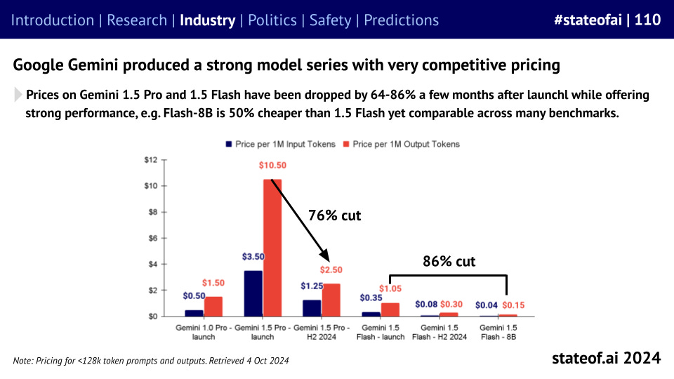
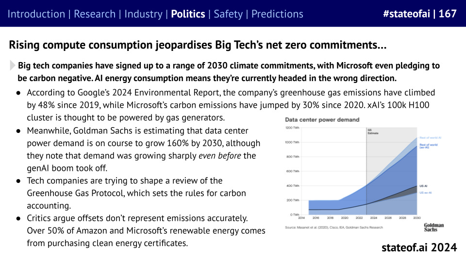
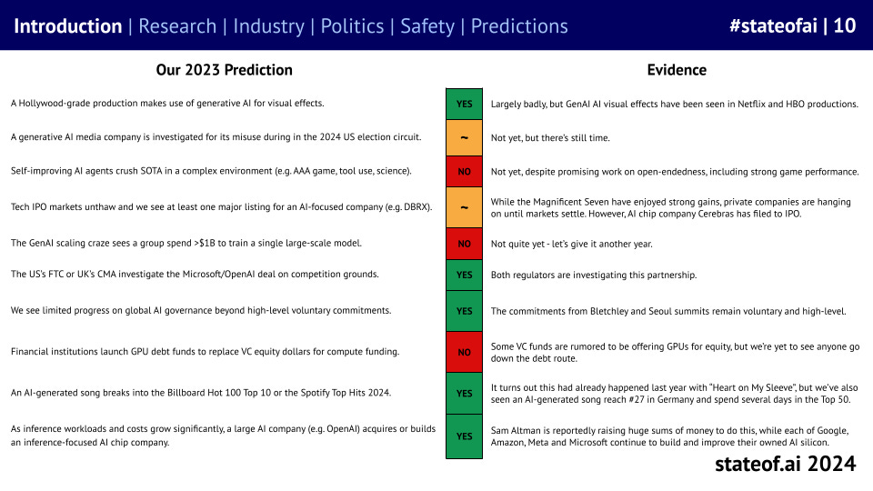

# The State of AI Report 2024

## Key Takeaways
- **Frontier lab performance begins to converge and proprietary models lose their edge,** as the gap between GPT-4 and the rest closes. OpenAI o1 put the lab back at the top of the charts - but for how long?
- **Planning and reasoning take priority in LLM research,** as companies explore combining LLMs with reinforcement learning, evolutionary algorithms, and self-improvement to unlock future agentic applications.
- **Foundation models demonstrate their ability to break out of language,** supporting multimodal research across mathematics, biology, genomics, the physical sciences, and neuroscience.
- **US sanctions have limited effects on Chinese labs’ ability to produce capable models,** as a combination of stockpiles, approved hardware, smuggling, and cloud access allow them to build highly performant (V)LLMs. Meanwhile, China’s efforts to build a domestic semiconductor industry remain scrambled.
- **The enterprise value of AI companies has hit $9T,** as public companies experience a bull market for AI exposure. Investment in private AI companies also increased, but by an order of magnitude less, despite GenAI megarounds in the US.
- **A handful of AI companies begin to generate serious revenue,** including foundation model builders and start-ups working on video and audio generation. However, as models get cheaper as part of the corporate land-grab, questions around long-term sustainability go unanswered.
- **The pseudo-acquisition emerges as an off-ramp for AI companies,** as some companies struggle to find a viable business model as staying at the frontier proves costly.
- **The existential risk discourse has cooled off,** especially following the abortive coup at OpenAI. However, researchers have continued to deepen our knowledge of potential model vulnerabilities and misuse, proposing potential fixes and safeguards.

_Source: [https://www.stateof.ai/2024-report](https://www.stateof.ai/2024-report-launch)_

## Key Themes and Ideas
For a while, it looked like OpenAI’s competitors had succeeded in closing the gap, with frontier lab performance converging significantly as the year went on…

 

…but it was not to last, as inference-time compute and chain-of-thought drove stunning early results from o1.

 

But the open vs. proprietary gap appears to be no more, as Llama 3.1 405B shows that open weights models can hold their own against the best. And just a few weeks ago, Llama 3.2 went multi-modal.

 

Must models be big before they can become smaller, as Andrej Karpathy has argued? Impressive results with pruning and distillation across text-to-text and text-to-image suggest striking efficiency gains are possible.

 

Meanwhile, Chinese models have continued to climb up the leaderboard, despite US sanctions, while Chinese labs have emerged as popular open source contributors.

 

Previous editions of the report have covered the use of LLMs for de novo protein design. Our friends at Profluent have taken this a step further, using a finetuned model to build functional gene editors. Side note! Just yesterday, the Nobel Prize for Chemistry was awarded to Hassabis, Jumper and Baker for AlphaFold :-)

 

And in this year’s report, we have our biggest ever robotics section, reflecting the explosion in interest, including Google DeepMind, our friends at Hugging Face, Sereact and others.

 

Speaking of hardware, NVIDIA continues to reign supreme, despite their established competitors throwing money at their software ecosystems, and new challengers continuing to emerge.

 

While new challengers are picking up a little bit of momentum, with Cerebras as the standout performer so far, NVIDIA continues to be used more than 11x all of its peers combined in AI research.

 

Meanwhile, all the capital invested in NVIDIA competitors would have performed far better for investors had they invested in NVIDIA itself.

 

A100 clusters largely haven’t changed as industry has focused on the newer and shinier H100s. Meanwhile, the first GB200 clusters are going live over the next year.

 

We’re now beginning to see a split among AI-first start-ups. The biggest model builders are now seeing real revenues to match their soaring valuations, while some buzzier start-ups’ multi-billion dollar valuations can seem more vibes-driven.

 

However, OpenAI’s billions in revenue are yet to translate into a profitable business model. As training runs begin to cost hundreds of millions of dollars, if not billions, no path to profitability is in sight.

 

One way of turning round your share price is to ditch your metaverse investments, pivot hard into open source AI, and become the face of the American industrial renaissance. That’s exactly the approach Meta has taken, with Llama-based models soaring above 440M downloads on Hugging Face.

 

Once considered too expensive to be realistic, inference prices are collapsing. Is this the product of efficiency gains, or are we the lucky beneficiaries of a price war, as the main foundation model builders battle for market and mindshare?

 

As model performance converges, companies are investing more in products to differentiate. Claude Artifacts has emerged as a developer favorite, while OpenAI is rushing to imitate it with its Canvas feature.

 

However, not everyone is a winner. Prominent voices in the community like Ed Newton-Rex have been rallying a growing coalition of creators against big tech companies. Big tech’s fair use arguments should expect to come under significant legal scrutiny in 2025.

 

After years of missed promises, self-driving car companies are surging ahead, with Wayve, led by my friend Alex Kendall, along with Waymo, emerging as early winners.

 

Based on transaction data from Ramp, companies that purchase AI products are both paying more for them and retaining usage longer. Indeed, this past year’s cohort is performing much better than the year prior.

 

Stripe data also shows that AI-first companies founded after 2020 are scaling significantly quicker than their peers, with the most successful hitting $30M+ in 20 months versus 65 for traditional SaaS. This is hugely impressive.

 

Meanwhile, over in the world of biotech, we’re seeing one of the first landmark AI deals. Recursion, which is industrializing discovery in biology using high-throughput AI-first experimentation, is acquiring AI-first precision medicine company Exscientia.

Get hyped for a full-stack discovery and design company with the largest GPU cluster in biopharma as seen on [stateof.ai/compute](https://stateof.ai/compute)

 

In the world of video generation, players including Runway, Pika, and Luma are now able to create increasingly impressive and consistent short-generations, but they still struggle with longer, more complex clips. Meta too is joining the party.

 

In the world of consumer hardware, Meta’s AI-powered Ray-Bans have proven a surprise smash hit - combining style with clear functionality. Other devices, less so…

 

US private markets, powered by genAI mega-rounds, have led a global wave of Ai investments, with annual totals closing in on $100B. Public markets have soared beyond their 2021 highs, with AI companies packing almost $9T in enterprise value.

 

But despite that, the weather remains frigid in M&A and IPO land, as regulators resist consolidation and post-Covid markets remain volatile.

 

But the newest hot trend this season, the pseudo acquisition, has emerged as a convenient exit route for AI founders and investors who aren’t willing to stomach ever-growing costs, although regulators have already started to take note.

 

The US has formalized the non-binding assurances it received from big AI labs around safety and notification, via executive order due to the lack of consensus around potential legislation. While this is quicker, it can be revoked at the stroke of a pen.

 

As Europe motors ahead on regulation, US labs are struggling to adapt. This is resulting in product launches either being abandoned or significantly slowed. That’s why Claude wasn’t available in Europe until \*May\* of this year.

 

As model builders scour for more data, many are turning to users - including Meta, LinkedIn, Alphabet and X. Regulators aren’t delighted, forcing freezes or the introduction of clear opt-out options.

 

The power requirements for AI systems are beginning to place infrastructure under strain, while jeopardizing big tech companies’ net zero commitments. 2030 pledges that seemed wise in 2019 are all set to be missed, based on current trends.

 

Now for a massive vibe shift: last year, the discussion around existential risk moved from the fringes to the center, but as companies seek to commercialize, it’s taken a back seat.

 

Researchers have attempted to bulk up model security, whether it’s OpenAI’s instruction hierarchy or Grey Swan’s circuit breakers. However, the community of jailbreakers, led by Elder Pliny, has made relatively short work of all of these approaches.

 

While technical communities enjoy discussing technical exploits, much of the real-world harm that results from GenAI usually stems from the relatively unsophisticated use of off-the-shelf products.

 

In each report, we produce a list of predictions for the upcoming 12 months and review the results of our prior year predictions to keep us honest. This year saw us over-estimate how quickly some research would prove out, but we did better on industry and policy questions.

 

And our predictions for the next 12 months! Covering NatSec, generative software, copyright, regulation, reasoning, hardware, on-device AI, AI scientists, and video games.

 

You can check out the [report](https://stateof.ai/) in full over on the State of AI website.

_Source: [https://press.airstreet.com/p/state-of-ai-report-2024](https://press.airstreet.com/p/state-of-ai-report-2024)_
