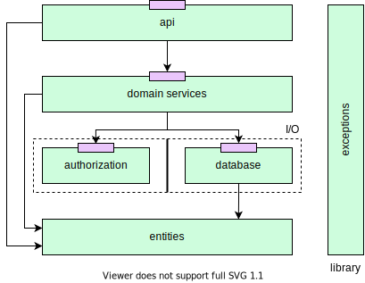

# Backend

  

## Resources

### [HttpDev](https://http.dev/)

A collection of resources on the HTTP protocol, which provides detailed explanations of various topics, such as headers, methods, status codes, and URIs.

[Similar, but only status codes.](https://http.cat/)

### [Learn REST API Design](https://www.restapitutorial.com/)

A comprehensive guide to REST API design through a series of lessons that cover the basics of RESTful web services e.g., the 6 constraints, resource naming, and so on.

### [BootDev](https://www.boot.dev/)

A course on back-end development consisting of numerous modules, each one delivered by a seasoned professional who specialises in that particular aspect of back-end

It covers basic concepts such as programming languages (Python, Go), HTTP, and Git, as well as more advanced topics like Functional Programming, Pub/Sub, and CI/CD.

## Articles

- [Best Practices for Designing a Pragmatic RESTful API](https://www.vinaysahni.com/best-practices-for-a-pragmatic-restful-api)

- [How I design JSON API responses](https://shazow.net/posts/how-i-design-json-api-responses/)

- [Representing Response Object in REST API](https://shekhargulati.com/2018/05/18/til-5-representing-response-object-in-rest-api/)

## Community QA

- [Is there any standard for JSON API response format?](https://stackoverflow.com/questions/12806386/is-there-any-standard-for-json-api-response-format)
