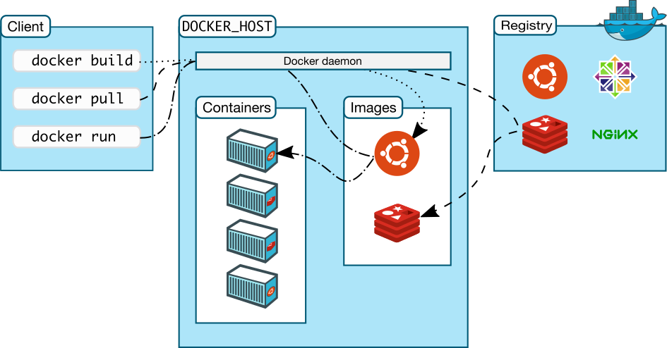

# Docker 🐳

Notes, snippets, and resources about Docker to remind myself of the different notions for development and deployment.

## Quick Access

    
Docker Architecture

    

        
    

    
Docker Architecture 2 (detailed)

    

        
    

## Resources and Tools

### [Docker Documentation](https://docs.docker.com/get-started/get-docker/) ⭐

The best resource for Docker concepts and a great place to start learning about the technology.

- [Langage-specific apps w/ Docker.](https://docs.docker.com/guides/language/)
- [Use-case Guides ](https://docs.docker.com/guides/use-case/) e.g., AWS deployment, Event-driven Kafka, NLP, and so on.
- [Developer Tools:](https://docs.docker.com/manuals/#developer-tools) Docker Desktop, Compose, Build, Engine, and Extensions
- [NEW: Docker for GitHub Copilot](https://docs.docker.com/copilot/) - an integrated agent to provide assistance with containerising apps and generating Docker assets.

### [Docker Projects for Container Tinkering](https://github.com/iximiuz/awesome-container-tinkering/) ⭐

A collection of tools to explore the Docker ecosystem and containerisation in general without the complexity of typical awesome-docker repos.

- Container runtimes
- Image builders, viewers, editors
- Development environments
- Container networking tools
- Image distribution and artifact management
- Interesting GitHub organizations
- Container Standards and Specifications

## Articles

#### iximiuz.com

- [Learning Containers From The Bottom Up](https://iximiuz.com/en/posts/container-learning-path/) ⭐

- [Journey From Containerization To Orchestration And Beyond](https://iximiuz.com/en/posts/journey-from-containerization-to-orchestration-and-beyond/) ⭐

- [The Need For Slimmer Containers](https://iximiuz.com/en/posts/thick-container-vulnerabilities/)

- [You Don't Need an Image To Run a Container](https://iximiuz.com/en/posts/you-dont-need-an-image-to-run-a-container/)

- [How Docker Build Command Works Internally: You Need Containers To Build Images](https://iximiuz.com/en/posts/you-need-containers-to-build-an-image/)

- [Not Every Container Has an Operating System Inside](https://iximiuz.com/en/posts/not-every-container-has-an-operating-system-inside/)

#### medium.com

- [How does Docker ACTUALLY work? The Hard Way: A Comprehensive Technical Deep Diving](https://medium.com/@furkan.turkal/how-does-docker-actually-work-the-hard-way-a-technical-deep-diving-c5b8ea2f0422)
