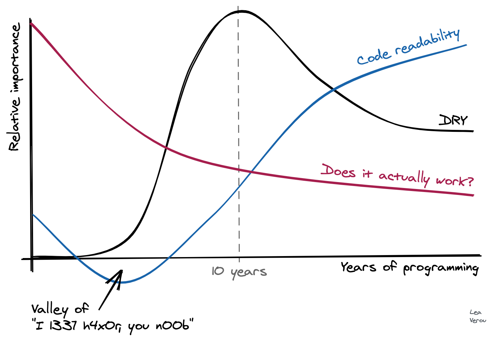

# The Grug Brained Developer
A caveman-styled software development manifesto that encourages simple, maintainable code over complex abstractions and over-engineering.

## Introduction
- grug brain developer not so smart, but grug brain developer program many long year and learn some things although mostly still confused
- grug brain developer try collect learns into small, easily digestible and funny page
- grug once think big brained but learn hard way...

## The Eternal Enemy: Complexity
- apex predator of grug is complexity - very, very bad
- given choice between complexity or one on one against t-rex, grug take t-rex: at least grug see t-rex
- is spirit demon that enter codebase through well-meaning developers, but ultimately very clubbable (easily influenced) non grug-brain developers and project managers
- one day code base understandable and grug can get work done, everything good!
- next day impossible: complexity demon spirit has entered code
- complexity demon mock grug, make change here break thing there

### Saying No
- best weapon against complexity spirit demon is magic word: "no"
- grug must say "no" to feature, "no" to abstraction - hard say at first but gets easier
- this good engineering advice but bad career advice: "yes" means more shiney rock and bigger tribe
- sad but true: learn "yes" then learn blame other grugs when fail, ideal career advice

### Saying ok
- sometimes compromise necessary or no shiney rock
- grug think of [80/20 solution](https://en.wikipedia.org/wiki/Pareto_principle) say "80 want with 20 code"
- solution maybe not have all bell-whistle, but work and deliver
- sometimes probably best just not tell project manager and do it 80/20 way. easier forgive than permission

### Refactoring
- harder so not factor code too early!
- take time to develop "shape" of system and learn what even doing
- good cut point has narrow interface with rest of system: small number of functions or abstractions that hide complexity demon internally
- grug try watch patiently as cut points emerge from code and slowly refactor
- big brain developers often not like this at all and invent many abstractions start of project
- working demo especially good trick: force big brain make something to actually work

## Testing
- grug have love/hate relationship with test: test save grug many, many time
- prefer write most tests after prototype phase, when code has begun firm up
- [unit tests](https://en.wikipedia.org/wiki/Unit_testing) fine, ok, but break as implementation change and make refactor hard
- [end to end tests](https://smartbear.com/learn/automated-testing/what-is-end-to-end-testing/) good, show whole system work, but hard to understand when break
- [integration test](https://en.wikipedia.org/wiki/Integration_testing) (in-between test as shaman calls it) is sweet spot:
  - high level enough test correctness, low level enough debug easy
  - low level enough, with good debugger, easy to see what break
- also small, well curated end-to-end test suite is created to be kept working religiously on pain of clubbing
- grug dislike [mocking](https://en.wikipedia.org/wiki/Mock_object) in test, only use when must
- rug always try first reproduce bug with regression test *then* fix bug

## Agile
- agile not terrible, not good
- danger, however, is agile shaman! many, many shiney rock lost to agile shaman!
- whenever agile project fail, agile shaman say "you didn't do agile right!"
- prototyping, tools and hiring good grugs better key to success software
- grug say [no silver club](https://en.wikipedia.org/wiki/No_Silver_Bullet) fix all software problems no matter what agile shaman say

## Refactoring
- refactoring fine activity and often good idea, especially later in project (more code)
- grug notice that larger refactor, more likely failure appear to be
- grug try to keep refactors relatively small and not be "too far out from shore" during refactor
- introducing too much abstraction often lead to refactor failure and system failure
- good example was [J2EE](https://www.webopedia.com/definitions/j2ee/) introduce, many big brain sit around thinking too much abstraction, nothing good came of it
- example when company introduce [OSGi](https://www.techtarget.com/searchnetworking/definition/OSGi) to help manage/trap spriit complexity demon in code base
- not only OSGi not help, but make complexity demon much more powerful

## Chesterton's Fence
- wise grug [Chesterton](https://en.wikipedia.org/wiki/G._K._Chesterton) say: no remove fence if not know why fence there
- many older grug learn this lesson well not start tearing code out willy nilly, no matter how ugly look
- world is ugly and gronky many times and so also must code be
- grug not say no improve system ever, quite foolish, but recommend take time understand system first
- tests often good hint for why fence not to be smashed!

## Microservices
- grug wonder why big brain take hardest problem
- factoring system correctly, and introduce network call too

## Tools
- tool allow grug brain to create code that not possible otherwise by doing thinking for grug
- code completion in IDE allow grug not have remembered all API
- good debugger worth weight in shiney rocks
- grug recommend new programmer learn available debugger very deeply
- grug say never be not improving tooling

## Type Systems
- type systems most value when grug hit dot on keyboard and list of things grug can do pop up magic
- big brain type system shaman often say type correctness main point type system, but grug note some big brain type system shaman not often ship code
- some type big brain think in type systems and talk in lemmas, potential danger!
- generics especially dangerous here, grug try limit generics to container classes for most part
- most value type system come: hit dot see what grug can do, never forget!

## Expression Complexity
- grug once like to minimise lines of code much as possible
- over time grug learn this hard debug, learn prefer write like so:
	```js
	if (contact) {
		var contactIsInactive = !contact.isActive();
		var contactIsFamilyOrFriends =
	      contact.inGroup(FAMILY) || contact.inGroup(FRIENDS);
	      
	    if (contactIsInactive && contactIsFamilyOrFriends) {
	      // ...
	    }
	  }
	```
## DRY
- grug respect [DRY (Don't Repeat Self)](https://en.wikipedia.org/wiki/Don%27t_repeat_yourself) and good advice, however grug recommend balance in all things
- past ten years program grug not as concerned repeat code
- repeat/copy paste code with small variation is better than many callback/closures passed arguments or elaborate object model
- repeat code sometimes often better than complex DRY solution

  

## Separation of Concerns (SoC)
- [Separation of Concern (SoC)](https://en.wikipedia.org/wiki/Separation_of_concerns) another powerful idea over many developer mind, idea to separate different aspects of system into distinct sections code
- web dev: separation of style (css file), markup (html file) and logic (javascript file)
- grug prefer put code on the thing that do the thing
- when separate of concern grug must often all over tarnation many file look understand what how button do

## Closures
- grug like closures for right job and that job usually abstracting operation over collection of objects
- closures like salt: small amount go long way, but easy spoil things too much use
- javascript developers call special complexity demon spirit "callback hell" because too much closure

## Logging
- grug huge fan of logging and encourage lots of it, especially in cloud deployed
- log all major logical branches within code (if/for)
- if "request" span multiple machine, include request ID in all so logs can be grouped
- make log level dynamically controlled, so grug can turn on/off when need debug issue
- make log level per user, so can debug specific user issue

## Concurrency
- grug, like all sane developer, fear concurrency
- grug try to rely on simple concurrency models like stateless web request handlers and simple remote job worker queues
- optimistic concurrency seem work well for web stuff
- some language have good concurrent data structure, like java ConcurrentHashMap but still need careful grug work

## Optimising
- premature optimisation is the root of all evil
- grug recommend always to have concrete, real world perf profile showing specific perf issue before begin optimising
- hitting network equivalent of many, many millions cpu cycle and always to be minimised

## APIs
- unfortunately, many apis very bad, make grug think quite a bit.
  - API creators think in terms of implementation or domain of API, rather than in terms of use of API
  - API creators think too abstract and big brained
- grug recommend "layering" apis: two or three different apis at different level complexity for various grug needs
- java API make grug angry - why need stream and collector just to filter list?
- put common thing like filter() on list and make return list, not stream

## Parsing
- [recursive descent](https://en.wikipedia.org/wiki/Recursive_descent_parser) most fun and beautiful way create parser
- parser generator tool generate code of awful snakes nest: impossible understand
- grug recommend book [Crafting Interpreters](https://craftinginterpreters.com/) by Bob Nystrom

## The Visitor Pattern
- [bad](https://en.wikipedia.org/wiki/Visitor_pattern)

## Front End Development
- splitting front end and back end codebase means now you have two complexity demon spirit lairs
- front end complexity demon spirit even more powerful compared to back end
- grug make [htmx](https://htmx.org/) and [hyperscript](https://hyperscript.org/) to avoid complex front end
- react better for job but also you become alcolyte of complexity demon

## Fear Of Looking Dumb
- grug learn get over: very important senior grug say "this too complicated and confuse to me"
- this make it ok for junior grugs to admit too complex and not understand as well, often such case
- FOLD major source of complexity demon power over developer, especially young grugs
- note: important to make thinking face and look big brained when saying though.
  - be prepare for big brain
  - *thinks* is big brain to make snide remark of grug

## Impostor Syndrome
- grug note many such impostor feels in development
- now, grug make softwares of much work and [moderate open source success](https://star-history.com/#bigskysoftware/htmx&bigskysoftware/_hyperscript&Date) , and yet grug himself often feel not any idea what doing!
- is maybe nature of programming for most grug to feel impostor and be ok with is best: nobody imposter if everybody imposter

<br>

_Source: [https://grugbrain.dev/](https://grugbrain.dev/)_
