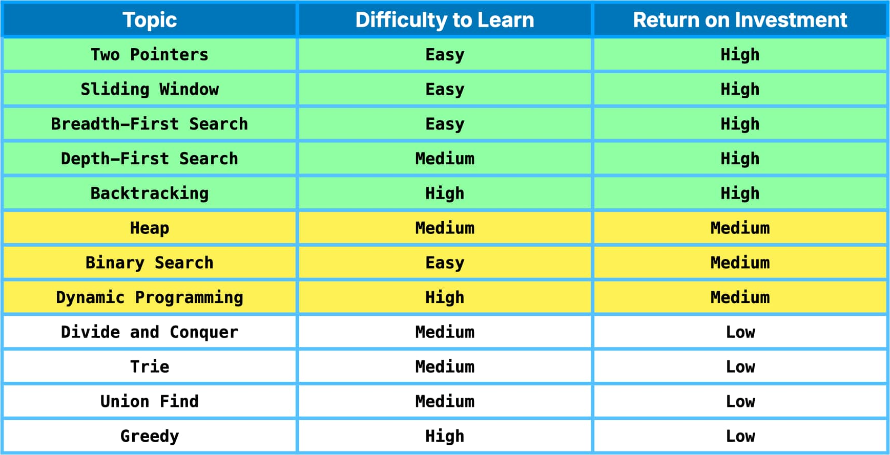
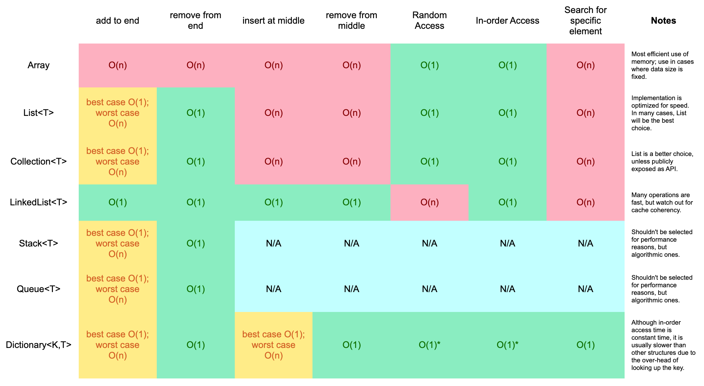

# 🏆 Interview

An ongoing grind to secure that cool entry-level programming job (SWE).

## Quick Access

&nbsp;Tips for Leetcode Patterns

 

&nbsp;&nbsp;&nbsp;**_IF INPUT ARRAY IS SORTED THEN_**

- &nbsp;Binary search
- &nbsp;Two pointers

&nbsp;&nbsp;&nbsp;**_IF ASKED FOR ALL PERMUTATIONS/SUBSETS THEN_**

- &nbsp;Backtracking

&nbsp;&nbsp;&nbsp;**_IF GIVEN A TREE THEN_**

- &nbsp;DFS
- &nbsp;BFS

&nbsp;&nbsp;&nbsp;**_IF GIVEN A GRAPH THEN_**

- &nbsp;DFS
- &nbsp;BFS

&nbsp;&nbsp;&nbsp;**_IF GIVEN A LINKED LIST THEN_**

- &nbsp;Two pointers

&nbsp;&nbsp;&nbsp;**_IF RECURSION IS BANNED THEN_**

- &nbsp;Stack

&nbsp;&nbsp;&nbsp;**_IF MUST SOLVE IN-PLACE THEN_**

- &nbsp;Swap corresponding values
- &nbsp;Store one or more different values in the same pointer

&nbsp;&nbsp;&nbsp;**_IF ASKED FOR MAXIMUM/MINIMUM SUBARRAY/SUBSET/OPTIONS THEN_**

- &nbsp;Dynamic programming

&nbsp;&nbsp;&nbsp;**_IF ASKED FOR TOP/LEAST K ITEMS THEN_**

- &nbsp;Heap
- &nbsp;QuickSelect

&nbsp;&nbsp;&nbsp;**_IF ASKED FOR COMMON STRINGS THEN_**

- &nbsp;Map
- &nbsp;Trie

&nbsp;&nbsp;&nbsp;**_ELSE_**

- &nbsp;Map/Set for O(1) time & O(n) space
- &nbsp;Sort input for O(nlogn) time and O(1) space

 

&nbsp;Solving LeetCode problems

- [github/tiationg-kho/leetcode-pattern-500](https://github.com/tiationg-kho/leetcode-pattern-500)

- [Don’t Just LeetCode; Follow the Coding Patterns Instead](https://levelup.gitconnected.com/dont-just-leetcode-follow-the-coding-patterns-instead-4beb6a197fdb)

- [Algomaster: LeetCode was HARD until I Learned these 15 Patterns](https://blog.algomaster.io/p/15-leetcode-patterns)

    
&nbsp;ROI Table for DSA Topics

    

        &nbsp;&nbsp;&nbsp;&nbsp;
    

    
&nbsp;Big-O Cheatsheet I

    

        &nbsp;&nbsp;&nbsp;
    

    
&nbsp;Big-O Cheatsheet II

    

        &nbsp;&nbsp;&nbsp;
    

## Resources & Tools

### 🧑‍💻 [NeetCode](https://neetcode.com/)

A collection of Leetcode questions organised by topic/pattern and 580 distinct video solutions.

### 🔍 [Leetcode Patterns](https://seanprashad.com/leetcode-patterns/)

It helps to recognise the patterns when solving coding problems found on Leetcode (coding problems are all about pattern recognition and recall). Also, it is recommended to focus on the most [common patterns](https://algo.monster/problems/stats) first.

### 📚 [Tech (SWE) Interview Handbook](https://www.techinterviewhandbook.org/)

A collection of interview preparation materials, which is ideal for last-minute interview prep or quick brush-ups. Another version is the [Front End Interview Handbook](https://www.frontendinterviewhandbook.com/).

### 🤖 [Marble - Leetcode Tutor](https://withmarble.io/)

A chrome extension that provides AI-powered interactive walkthroughs for any LeetCode problem.

### 🎓 [Hello Algo Course](https://www.hello-algo.com/en/)

An open-source and comprehensive course on DSA that provides easy-to-understand animations with runnable code examples in 14 different languages.

### [Python DSA Cheatsheet](https://github.com/AbdulMalikDev/PythonCheatSheet)

A cheatsheet to revise Python syntax that's particularly useful when solving coding problems.

### [Cheatsheet: Big-O Comparison for DSA](https://cooervo.github.io/Algorithms-DataStructures-BigONotation/index.html)

Comparing the Big-O of algorithms and data structures, as well as the different growth rates.

## Articles

### Coding

- [Dynamic Programming Patterns](https://leetcode.com/discuss/general-discussion/458695/Dynamic-Programming-Patterns)

- [List of questions sorted by common patterns.](https://leetcode.com/discuss/career/448285/List-of-questions-sorted-by-common-patterns)

- [Grokking LeetCode: A Smarter Way to Prepare for Coding Interviews](https://interviewnoodle.com/grokking-leetcode-a-smarter-way-to-prepare-for-coding-interviews-e86d5c9fe4e1)

- [Don’t Just LeetCode; Follow the Coding Patterns Instead](https://levelup.gitconnected.com/dont-just-leetcode-follow-the-coding-patterns-instead-4beb6a197fdb)

- [14 Patterns to Ace Any Coding Interview Question](https://hackernoon.com/14-patterns-to-ace-any-coding-interview-question-c5bb3357f6ed)

### System Design

- [System Design Interview Survival Guide (2024): Preparation Strategies and Practical Tips](https://levelup.gitconnected.com/system-design-interview-survival-guide-2023-preparation-strategies-and-practical-tips-ba9314e6b9e3)
