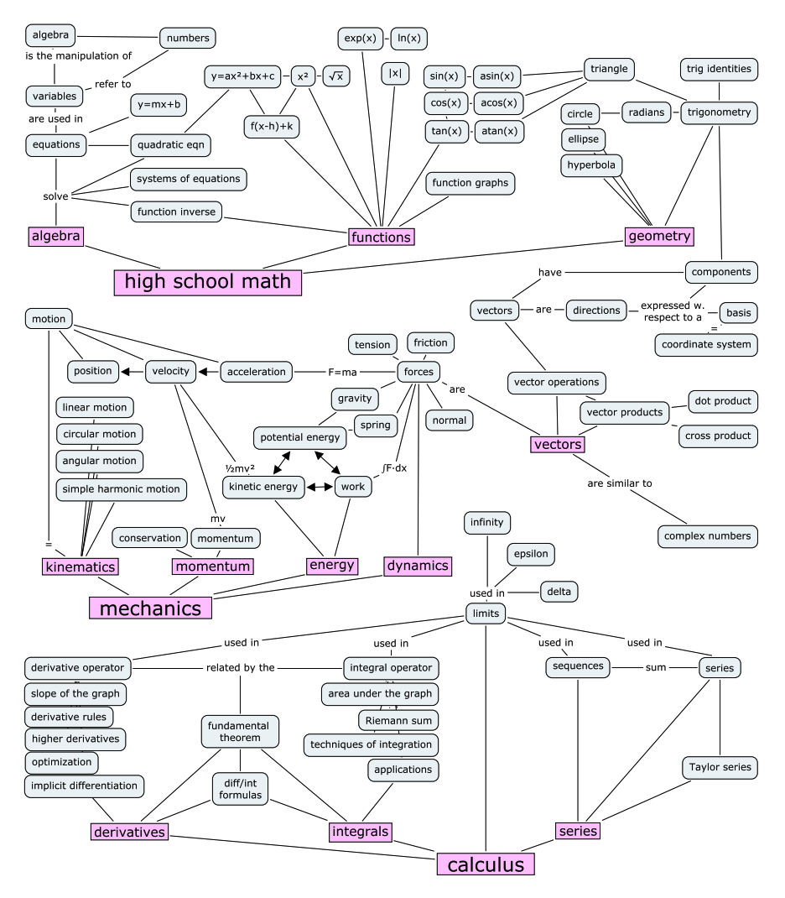

# Mathematics 📐

	

	    
Map of mathematical concepts

		
Source: <a href="https://minireference.com/" target="__blank">https://minireference.com/</a>

	    
	

## Resources
### [Paul's Online Notes](https://tutorial.math.lamar.edu/) ⭐
Notes and cheatsheets on algebra, calculus, and differential equations.

### [Introduction to Probability, Statistics, and Random Processes](https://www.probabilitycourse.com/)
An online book that covers probability, statistics, and random processes.

### [Seeing Theory: Intro to Statistics with Visualisations](https://seeing-theory.brown.edu/index.html)
A visual introduction to probability and statistics, helping readers build an intuition for the subjects. An option to download a PDF version is available.

### [Mathematics for the adventurous self-learner](https://www.neilwithdata.com/mathematics-self-learner)
A curated list of books for self-learning mathematics with the author's (a software developer and math enthusiast) reviews and recommendations based on skill level.

## Books
- [No Bullshit Guide to Math & Physics](https://minireference.com/)
- [Introduction to Probability, Statistics, and Random Processes](https://www.probabilitycourse.com/)
