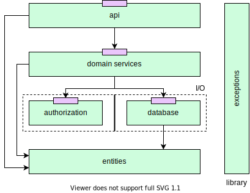

# Web

# Resources

### [REST API - Layered Architecture](https://mavericks.fi/layered-architecture-for-rest-apis/)

An article that briefly describes the layered architecture of REST APIs.

### [HttpDev](https://http.dev/)

A collection of resources regarding the HTTP protocol (status codes, headers, methoods).

# Articles

- [How I design JSON API responses](https://labs.omniti.com/labs/jsend)

# Community QA

- [Is there any standard for JSON API response format?](https://stackoverflow.com/questions/12806386/is-there-any-standard-for-json-api-response-format)
